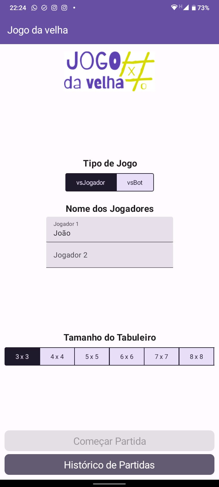

# Jogo da Velha

Projeto de Jogo da Velha feito em Kotlin, na biblioteca Jetpack Compose

## Objetivos

* Realizar teste como requisito de processo seletivo
* Aprender mais sobre Kotlin
* Aprender mais sobre Jetpack Commpose

## Estrutura

O projeto foi estruturado de forma bem simples, que reflete a simplicidade da aplicação.
Na parte de UI, ele contém 3 telas:

1. A tela inicial
2. A tela de jogo
3. A tela de Histórico de Partidas

Cada uma dessas telas foi desenvolvida conforme requisito apresentado.

## Telas

### Tela Inicial

Tela simples de apresentação do jogo, contendo:

* Seleção de jogo vs Jogador e vs Robô
* Campos para inserção dos nomes do jogadores (O nome do jogador 1 fica salvo entre partidas e
  execuções)
* Seleção do Tamanho do Tabuleiro, indo de 3x4 até 10x10
* Botão para "Começar a Partida", onde só se ativa com todos os campos preenchidos
* Botão para "Histórico de Partidas"

### Tela de Game

Tela onde ocorre a ação do Jogo. Contém:

* Texto de status, que indica de quem é a vez de jogar, se alguém venceu ou deu velha
* O tabuleiro em si, conforme seleção na tela anterior
* Botão para recomeçar jogo atual (os dados da partida ficam salvos)
* Botão para começar novo jogo, que retorna a tela inicial (os dados de partida ficam salvos)

### Tela de Histórico

Tela onde mostra o histórico de partidas, da partida jogada mais recentemente para a mais antiga.
Contém:

* Lista de partidas
* Paginação
* Botão de voltar

## Tematização

A tematização foi feita em Material Design, que já vem incluído no Jetpack Compose, o qual tirei
proveito do ajuste automático entre esquema de cores para tema claro e escuro. Sendo assim, a
aplicação apresenta-se com estes dois temas que se ativam conforme esquema de cores do smartphone.

_Tema Claro_

_Tema Escuro_

## Persistência

Para a camada de persistência, optei por utilizar a bilbioteca Room, sendo a que é recomendada pelo
tutorial oficial do Jetpack Compose para Android.

A biblioteca consiste em utilizar DAO's no estilo do Spring Data JPA, com repositórios e métodos
anotados, tornando mais fácil manipular a camada de persistência no projeto.

Optei por implementar essa camada diretamente no ViewModel, assim, as regras de UI e de Negócio
ficam
melhores abstraidas nesta camada.